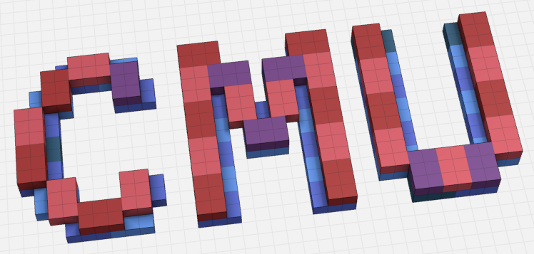
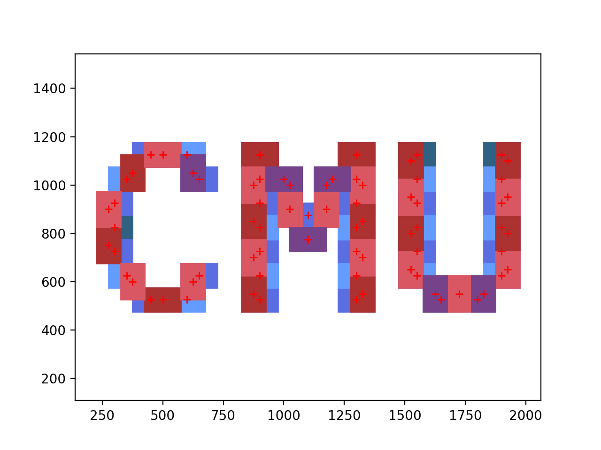

# Arm Navigation

## Parsing Script



### Usage

Call this function to obtain an ordered build list based on the goal structure, robot current position, and robot's parameters.

```CurrentBuildList(voxelFile, unitToMM, robot_pos, l1, l2, v)```

### Input

- ```voxelFile```: voxel list txt file obtain from the Goxel software, it should look like this:

  ```
  # X Y Z RRGGBB    // delete all comments before passing in!
  5 16 0 306082
  6 16 0 306082
  7 16 0 306082
  ... ... ...
  ```

  Note that you must delete all comments at the start of .txt file, as those will confuse the parser.

- ```unitToMM```: The length in real world per unit in the Goxel software. e.g. if the block is made up of 2*3 soda cans, and each can have a diameter of 5 cm, then ```unitToMM``` should be set to 50.
- ```robot_pos```: The robot's current position, in the world frame, given in an array ```[x, y, z]```.
- ```l1, l2```: the length of robot's two links, the script currently assumes this would form a RR arm.
- ```v```: The vertical limit of the robot arm.

### Output

A yaml file with each entry a block's center position given in ```[x, y, z, color, orientation]```. The order of the block is the oder the robot should place them. 

```yaml
- - 1550.0
  - 625.0
  - 0
  - 639bff
  - 0
- - 1550.0
  - 725.0
  - 0
  - 5b6ee1
  - 0
... ...
```

The orientation is set to 0 if it's a horizontal block, and 90 if it's a vertical block.

### Useful Subfunctions

```helper.Visualize(blocks, centers, unitToMM)``` will draw a visualization of all the blocks in the voxel file and the centers find.



